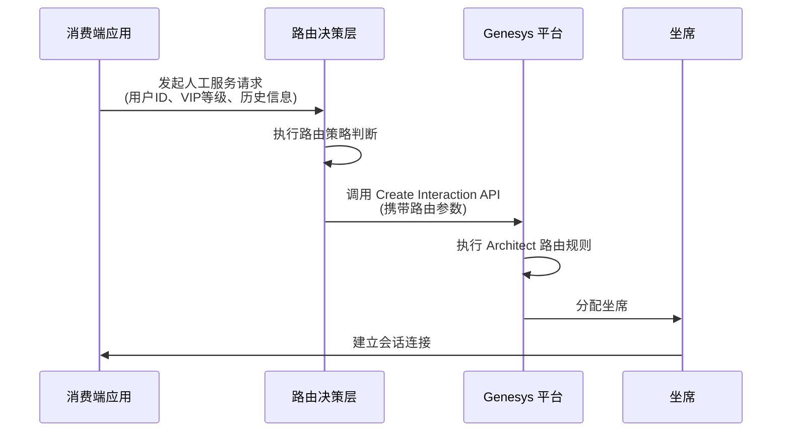
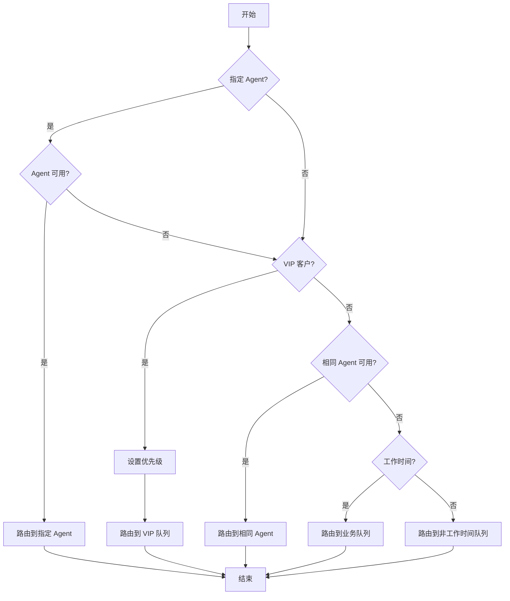

# Genesys 人工分配功能路由设计文档

## 一、概述

本文档描述消费端与 Genesys 平台对接的人工分配功能相关路由设计，涵盖 VIP 路由、指定 Agent 路由、限定时间路由、相同 Agent 路由等策略。

## 二、Genesys 路由功能概述

### 2.1 核心路由类型

| 路由类型 | 描述 | 适用场景 |
|---------|------|---------|
| VIP 路由 | 根据客户 VIP 等级优先分配 | 高价值客户服务 |
| 指定 Agent 路由 | 直接路由到指定的坐席 | 专属服务、专家咨询 |
| 限定时间路由 | 在特定时间段内路由 | 上班时间服务 |
| 相同 Agent 路由 | 路由到上次服务的同一坐席 | 连续性服务体验 |

### 2.2 路由优先级

```
指定 Agent > VIP 路由 > 相同 Agent > 限定时间 > 默认路由
```

## 三、系统对接架构设计

### 3.1 整体架构图

```
┌─────────────┐      ┌─────────────┐      ┌─────────────┐
│  消费端应用  │─────>│  路由决策层  │─────>│ Genesys 平台 │
│  (Client)   │      │ (Router)    │      │  (GCXI)     │
└─────────────┘      └─────────────┘      └─────────────┘
        │                    │                    │
        └────────────────────┴────────────────────┘
                     REST API / WebSocket
```

### 3.2 组件说明

#### 3.2.1 消费端应用
- 负责发起人工服务请求
- 携带用户上下文信息（VIP 等级、历史服务等）

#### 3.2.2 路由决策层
- 接收消费端请求
- 根据策略判断路由目标
- 生成路由参数调用 Genesys

#### 3.2.3 Genesys 平台
- 处理路由请求
- 分配坐席资源
- 建立会话连接

### 3.3 交互流程



## 四、路由策略详细设计

### 4.1 VIP 路由

#### 4.1.1 策略描述
根据客户的 VIP 等级，将请求路由到高优先级队列或专属坐席池。

#### 4.1.2 数据结构
```json
{
  "customer": {
    "id": "CUST001",
    "vipLevel": "GOLD",  // PLATINUM, GOLD, SILVER, NORMAL
    "tier": 3
  },
  "routing": {
    "strategy": "VIP",
    "queue": "VIP_QUEUE_GOLD",
    "priority": 8
  }
}
```

#### 4.1.3 实现代码示例
```typescript
interface VipRoutingRequest {
  customerId: string;
  vipLevel: 'PLATINUM' | 'GOLD' | 'SILVER' | 'NORMAL';
  requestedService: string;
}

class VipRouter {
  private queueMapping = {
    'PLATINUM': 'VIP_QUEUE_PLATINUM',
    'GOLD': 'VIP_QUEUE_GOLD',
    'SILVER': 'VIP_QUEUE_SILVER',
    'NORMAL': 'DEFAULT_QUEUE'
  };

  private priorityMapping = {
    'PLATINUM': 10,
    'GOLD': 8,
    'SILVER': 5,
    'NORMAL': 1
  };

  async route(request: VipRoutingRequest): Promise<RoutingResult> {
    const queue = this.queueMapping[request.vipLevel];
    const priority = this.priorityMapping[request.vipLevel];

    return {
      strategy: 'VIP',
      target: {
        type: 'QUEUE',
        name: queue,
        priority: priority
      },
      attributes: {
        customer_id: request.customerId,
        vip_level: request.vipLevel
      }
    };
  }
}
```

### 4.2 指定 Agent 路由

#### 4.2.1 策略描述
将请求直接路由到指定的坐席，适用于专属客服场景。

#### 4.2.2 数据结构
```json
{
  "customer": {
    "id": "CUST001",
    "assignedAgent": "AGENT_123"
  },
  "routing": {
    "strategy": "SPECIFIC_AGENT",
    "targetAgent": "AGENT_123",
    "fallback": true
  }
}
```

#### 4.2.3 实现代码示例
```typescript
interface SpecificAgentRoutingRequest {
  customerId: string;
  targetAgentId: string;
  reason?: string;
  fallbackOnUnavailable?: boolean;
}

class SpecificAgentRouter {
  async route(request: SpecificAgentRoutingRequest): Promise<RoutingResult> {
    // 验证目标坐席是否在线
    const agentStatus = await this.checkAgentStatus(request.targetAgentId);

    if (agentStatus === 'AVAILABLE') {
      return {
        strategy: 'SPECIFIC_AGENT',
        target: {
          type: 'AGENT',
          id: request.targetAgentId
        },
        attributes: {
          customer_id: request.customerId,
          routing_reason: request.reason || 'DEMAND'
        }
      };
    } else if (request.fallbackOnUnavailable) {
      // 回退到默认路由
      return await this.fallbackToDefault(request);
    } else {
      throw new Error(`Target agent ${request.targetAgentId} is not available`);
    }
  }

  private async checkAgentStatus(agentId: string): Promise<string> {
    // 调用 Genesys API 检查坐席状态
    const response = await genesysAPI.get(`/users/${agentId}/presence`);
    return response.data.systemPresence;
  }

  private async fallbackToDefault(request: SpecificAgentRoutingRequest): Promise<RoutingResult> {
    return {
      strategy: 'FALLBACK',
      target: {
        type: 'QUEUE',
        name: 'DEFAULT_QUEUE'
      },
      attributes: {
        customer_id: request.customerId,
        original_target: request.targetAgentId,
        fallback_reason: 'AGENT_UNAVAILABLE'
      }
    };
  }
}
```

### 4.3 限定时间路由

#### 4.3.1 策略描述
根据当前时间和配置的时段规则，决定路由目标。

#### 4.3.2 数据结构
```json
{
  "routing": {
    "strategy": "TIME_BASED",
    "rules": [
      {
        "name": "Business Hours",
        "timeSlots": [
          { "start": "09:00", "end": "18:00", "days": [1,2,3,4,5] }
        ],
        "target": "BUSINESS_QUEUE"
      },
      {
        "name": "Off Hours",
        "timeSlots": [
          { "start": "18:01", "end": "08:59", "days": [1,2,3,4,5] },
          { "start": "00:00", "end": "23:59", "days": [0,6] }
        ],
        "target": "AFTER_HOURS_QUEUE"
      }
    ]
  }
}
```

#### 4.3.3 实现代码示例
```typescript
interface TimeSlot {
  start: string;  // HH:mm
  end: string;    // HH:mm
  days: number[]; // 0-6, Sunday to Saturday
}

interface TimeBasedRoutingRule {
  name: string;
  timeSlots: TimeSlot[];
  targetQueue: string;
}

class TimeBasedRouter {
  private rules: TimeBasedRoutingRule[];

  constructor(rules: TimeBasedRoutingRule[]) {
    this.rules = rules;
  }

  async route(customerId: string): Promise<RoutingResult> {
    const currentTime = new Date();
    const dayOfWeek = currentTime.getDay();
    const currentTimeStr = currentTime.toTimeString().slice(0, 5); // HH:mm

    for (const rule of this.rules) {
      for (const slot of rule.timeSlots) {
        if (this.isTimeInSlot(currentTimeStr, dayOfWeek, slot)) {
          return {
            strategy: 'TIME_BASED',
            target: {
              type: 'QUEUE',
              name: rule.targetQueue
            },
            attributes: {
              customer_id: customerId,
              matched_rule: rule.name
            }
          };
        }
      }
    }

    // 默认路由
    return {
      strategy: 'DEFAULT',
      target: {
        type: 'QUEUE',
        name: 'DEFAULT_QUEUE'
      }
    };
  }

  private isTimeInSlot(currentTime: string, dayOfWeek: number, slot: TimeSlot): boolean {
    if (!slot.days.includes(dayOfWeek)) {
      return false;
    }

    return currentTime >= slot.start && currentTime <= slot.end;
  }
}
```

### 4.4 相同 Agent 路由

#### 4.4.1 策略描述
将请求路由到上次为该客户服务的坐席，提供连续性服务体验。

#### 4.4.2 数据结构
```json
{
  "customer": {
    "id": "CUST001",
    "lastAgent": "AGENT_123",
    "lastInteractionTime": "2026-02-18T14:30:00Z"
  },
  "routing": {
    "strategy": "SAME_AGENT",
    "targetAgent": "AGENT_123",
    "maxGapDays": 7,
    "fallback": true
  }
}
```

#### 4.4.3 实现代码示例
```typescript
interface SameAgentRoutingRequest {
  customerId: string;
  lastInteractionTime?: Date;
  maxGapDays?: number;
  fallbackOnUnavailable?: boolean;
}

class SameAgentRouter {
  private maxGapDays: number = 7;

  async route(request: SameAgentRoutingRequest): Promise<RoutingResult> {
    // 从历史记录获取上次服务的坐席
    const history = await this.getInteractionHistory(request.customerId);

    if (!history || !history.agentId) {
      throw new Error('No previous interaction found');
    }

    // 检查时间间隔
    const gapDays = this.calculateGapDays(history.interactionTime);
    const maxGap = request.maxGapDays ?? this.maxGapDays;

    if (gapDays > maxGap) {
      if (request.fallbackOnUnavailable) {
        return await this.fallbackToDefault(request);
      }
      throw new Error(`Previous interaction too old (${gapDays} days)`);
    }

    // 检查坐席状态
    const agentStatus = await this.checkAgentStatus(history.agentId);

    if (agentStatus === 'AVAILABLE') {
      return {
        strategy: 'SAME_AGENT',
        target: {
          type: 'AGENT',
          id: history.agentId
        },
        attributes: {
          customer_id: request.customerId,
          last_interaction: history.interactionTime,
          continuity_reason: 'PREVIOUS_AGENT'
        }
      };
    } else if (request.fallbackOnUnavailable) {
      return await this.fallbackToDefault(request);
    }

    throw new Error(`Previous agent ${history.agentId} is not available`);
  }

  private async getInteractionHistory(customerId: string): Promise<InteractionHistory | null> {
    // 从数据库或缓存获取历史记录
    const response = await historyService.getLatestInteraction(customerId);
    return response;
  }

  private calculateGapDays(previousTime: Date): number {
    const now = new Date();
    const diff = now.getTime() - previousTime.getTime();
    return Math.floor(diff / (1000 * 60 * 60 * 24));
  }
}
```

## 五、Genesys API 对接设计

### 5.1 认证配置

```typescript
interface GenesysAuthConfig {
  clientId: string;
  clientSecret: string;
  environment: string;  // prod, dev, test
  region: string;       // us-east-1, ap-northeast-1, etc.
}

class GenesysAuth {
  private config: GenesysAuthConfig;
  private accessToken: string | null = null;
  private tokenExpiry: number = 0;

  constructor(config: GenesysAuthConfig) {
    this.config = config;
  }

  async getAccessToken(): Promise<string> {
    if (this.accessToken && Date.now() < this.tokenExpiry) {
      return this.accessToken;
    }

    const response = await fetch(
      `https://login.${this.config.environment}.genesys.com/oauth/token`,
      {
        method: 'POST',
        headers: {
          'Content-Type': 'application/x-www-form-urlencoded'
        },
        body: new URLSearchParams({
          grant_type: 'client_credentials',
          client_id: this.config.clientId,
          client_secret: this.config.clientSecret
        })
      }
    );

    const data = await response.json();
    this.accessToken = data.access_token;
    this.tokenExpiry = Date.now() + (data.expires_in - 60) * 1000;

    return this.accessToken;
  }
}
```

### 5.2 创建会话交互 API

```typescript
interface CreateInteractionRequest {
  routingTarget: RoutingTarget;
  attributes: Record<string, string>;
  customerInfo?: CustomerInfo;
}

interface RoutingTarget {
  type: 'QUEUE' | 'AGENT' | 'SKILL_GROUP';
  name?: string;
  id?: string;
  priority?: number;
}

class GenesysInteractionAPI {
  private auth: GenesysAuth;
  private baseUrl: string;

  constructor(auth: GenesysAuth, environment: string) {
    this.auth = auth;
    this.baseUrl = `https://api.${environment}.genesys.com`;
  }

  async createInteraction(request: CreateInteractionRequest): Promise<string> {
    const token = await this.auth.getAccessToken();

    const requestBody = {
      routing: {
        target: request.routingTarget.type === 'QUEUE'
          ? { queueName: request.routingTarget.name }
          : request.routingTarget.type === 'AGENT'
          ? { userId: request.routingTarget.id }
          : { skillGroupId: request.routingTarget.id },
        priority: request.routingTarget.priority || 5
      },
      conversationAttributes: request.attributes,
      memberInfo: request.customerInfo ? {
        firstName: request.customerInfo.firstName,
        lastName: request.customerInfo.lastName,
        identifiers: [
          {
            type: 'CUSTOMER_ID',
            value: request.customerInfo.id
          }
        ]
      } : undefined
    };

    const response = await fetch(`${this.baseUrl}/api/v2/conversations`, {
      method: 'POST',
      headers: {
        'Authorization': `Bearer ${token}`,
        'Content-Type': 'application/json'
      },
      body: JSON.stringify(requestBody)
    });

    if (!response.ok) {
      throw new Error(`Failed to create interaction: ${response.statusText}`);
    }

    const data = await response.json();
    return data.id;
  }
}
```

### 5.3 查询坐席状态 API

```typescript
interface AgentStatus {
  userId: string;
  systemPresence: string;
  routingStatus: string;
  isAvailable: boolean;
}

class GenesysAgentAPI {
  private auth: GenesysAuth;
  private baseUrl: string;

  constructor(auth: GenesysAuth, environment: string) {
    this.auth = auth;
    this.baseUrl = `https://api.${environment}.genesys.com`;
  }

  async getAgentStatus(agentId: string): Promise<AgentStatus> {
    const token = await this.auth.getAccessToken();

    const response = await fetch(
      `${this.baseUrl}/api/v2/users/${agentId}/routingstatus`,
      {
        headers: {
          'Authorization': `Bearer ${token}`
        }
      }
    );

    if (!response.ok) {
      throw new Error(`Failed to get agent status: ${response.statusText}`);
    }

    const data = await response.json();
    return {
      userId: agentId,
      systemPresence: data.systemPresence,
      routingStatus: data.routingStatus.status,
      isAvailable: data.routingStatus.status === 'IDLE'
    };
  }
}
```

## 六、Architect 路由规则配置

### 6.1 Architect 概述

Genesys Architect 是一个可视化的流程设计工具，用于定义路由规则和业务流程。

### 6.2 路由流程设计步骤

#### 步骤 1: 创建新流程

1. 登录 Genesys Architect
2. 点击 "Create New" > "Inbound Call Flow" 或 "Inbound Message Flow"
3. 命名流程（如: `VIP_Routing_Flow`）

#### 步骤 2: 添加路由决策节点

```
开始节点 → 变量检查 → 路由决策 → 分配坐席 → 结束
```

#### 步骤 3: 配置变量

在 Architect 中定义以下变量：

| 变量名 | 类型 | 描述 | 来源 |
|-------|------|------|------|
| `Customer.VIPLevel` | String | VIP 等级 | API 参数 |
| `Customer.LastAgent` | String | 上次服务坐席 | 历史记录 |
| `Target.AgentId` | String | 目标坐席 ID | API 参数 |
| `Routing.Strategy` | String | 路由策略 | API 参数 |
| `Routing.Priority` | Number | 优先级 | 计算得出 |

#### 步骤 4: 设计决策逻辑

**决策节点 1: 检查指定 Agent 路由**

```architect
IF Routing.Strategy == "SPECIFIC_AGENT" AND Target.AgentId != ""
    CheckAgentAvailable(Target.AgentId)
    IF Available
        RouteToAgent(Target.AgentId)
    ELSE IF FallbackEnabled
        ContinueToNextDecision
    ELSE
        ReturnError("Agent not available")
```

**决策节点 2: 检查 VIP 路由**

```architect
IF Customer.VIPLevel IN ["PLATINUM", "GOLD", "SILVER"]
    Set Priority based on VIPLevel
    RouteToQueue("VIP_QUEUE_" + Customer.VIPLevel)
```

**决策节点 3: 检查相同 Agent 路由**

```architect
IF Customer.LastAgent != "" AND LastInteractionDays <= 7
    CheckAgentAvailable(Customer.LastAgent)
    IF Available
        RouteToAgent(Customer.LastAgent)
    ELSE
        ContinueToNextDecision
```

**决策节点 4: 限定时间路由**

```architect
CurrentTime = GetCurrentTime()
CurrentDay = GetCurrentDayOfWeek()

// 工作时间 (9:00-18:00, 周一至周五)
IF CurrentDay IN [1,2,3,4,5] AND CurrentTime >= "09:00" AND CurrentTime <= "18:00"
    RouteToQueue("BUSINESS_QUEUE")
ELSE
    RouteToQueue("AFTER_HOURS_QUEUE")
```

#### 步骤 5: 配置队列

在 Genesys 管理界面创建以下队列：

1. **VIP Queue Platinum** - 白金客户专用队列
2. **VIP Queue Gold** - 金牌客户专用队列
3. **VIP Queue Silver** - 银牌客户专用队列
4. **Business Queue** - 工作时间默认队列
5. **After Hours Queue** - 非工作时间队列
6. **Default Queue** - 默认队列

#### 步骤 6: 配置坐席技能组

| 技能组名称 | 技能要求 | 优先队列 |
|----------|---------|---------|
| VIP_Skill | VIP 服务认证 | VIP_* Queues |
| Expert_Skill | 专业领域专家 | 指定 Agent |
| General_Skill | 通用服务 | Default Queue |

### 6.3 Architect 表达式示例

**获取 VIP 优先级:**
```
CASE Customer.VIPLevel
  WHEN "PLATINUM" THEN 10
  WHEN "GOLD" THEN 8
  WHEN "SILVER" THEN 5
  ELSE 1
END
```

**检查是否工作时间:**
```
CurrentHour = FORMAT(Now(), "HH")
CurrentMinute = FORMAT(Now(), "mm")
CurrentDay = DAYOFWEEK(Now())

// 转换为 0-6 (周日为0)
AdjustedDay = IF(CurrentDay == 1) THEN 0 ELSE CurrentDay - 1

// 判断是否在工作时间内
(AdjustedDay >= 1 AND AdjustedDay <= 5) AND
((CurrentHour > 9 OR (CurrentHour == 9 AND CurrentMinute >= 0)) AND
 (CurrentHour < 18 OR (CurrentHour == 18 AND CurrentMinute <= 0)))
```

### 6.4 流程示例图



## 七、综合路由决策器设计

### 7.1 决策器架构

```typescript
interface RoutingRequest {
  customerId: string;
  customerInfo: CustomerInfo;
  context: RoutingContext;
}

interface RoutingContext {
  requestedStrategy?: string;
  targetAgentId?: string;
  lastAgentId?: string;
  lastInteractionTime?: Date;
  currentPriority?: number;
}

class UnifiedRoutingDecision {
  private routers: Map<string, Router>;
  private order: string[] = [
    'SPECIFIC_AGENT',
    'VIP',
    'SAME_AGENT',
    'TIME_BASED',
    'DEFAULT'
  ];

  constructor() {
    this.routers = new Map([
      ['SPECIFIC_AGENT', new SpecificAgentRouter()],
      ['VIP', new VipRouter()],
      ['SAME_AGENT', new SameAgentRouter()],
      ['TIME_BASED', new TimeBasedRouter()],
      ['DEFAULT', new DefaultRouter()]
    ]);
  }

  async decide(request: RoutingRequest): Promise<RoutingResult> {
    // 如果指定了策略，直接使用
    if (request.context.requestedStrategy) {
      const router = this.routers.get(request.context.requestedStrategy);
      if (router) {
        return await router.route(request);
      }
    }

    // 按优先级尝试各种策略
    for (const strategy of this.order) {
      const router = this.routers.get(strategy);
      if (!router) continue;

      try {
        const result = await router.route(request);
        if (result) {
          return result;
        }
      } catch (error) {
        console.log(`${strategy} router failed:`, error.message);
        continue;
      }
    }

    // 最终回退到默认路由
    return await this.routers.get('DEFAULT').route(request);
  }
}
```

### 7.2 完整调用示例

```typescript
async function handleHumanServiceRequest(request: HumanServiceRequest) {
  // 1. 构建路由请求
  const routingRequest: RoutingRequest = {
    customerId: request.customerId,
    customerInfo: {
      id: request.customerId,
      vipLevel: request.vipLevel,
      name: request.customerName
    },
    context: {
      requestedStrategy: request.routingStrategy,
      targetAgentId: request.targetAgentId,
      lastAgentId: request.lastAgentId,
      lastInteractionTime: request.lastInteractionTime
    }
  };

  // 2. 执行路由决策
  const decision = await routingDecision.decide(routingRequest);

  // 3. 调用 Genesys API 创建交互
  const interactionId = await genesysAPI.createInteraction({
    routingTarget: decision.target,
    attributes: decision.attributes,
    customerInfo: request.customerInfo
  });

  // 4. 返回结果
  return {
    interactionId,
    routingStrategy: decision.strategy,
    estimatedWaitTime: await getEstimatedWaitTime(decision.target)
  };
}
```

## 八、监控与日志

### 8.1 路由决策日志

```typescript
interface RoutingLog {
  timestamp: Date;
  customerId: string;
  attemptedStrategies: string[];
  selectedStrategy: string;
  target: RoutingTarget;
  reason?: string;
  fallbackCount: number;
}

class RoutingLogger {
  async log(decision: RoutingResult, request: RoutingRequest): Promise<void> {
    const logEntry: RoutingLog = {
      timestamp: new Date(),
      customerId: request.customerId,
      attemptedStrategies: request.context.attemptedStrategies || [],
      selectedStrategy: decision.strategy,
      target: decision.target,
      fallbackCount: request.context.fallbackCount || 0
    };

    await logRepository.save(logEntry);
  }
}
```

### 8.2 监控指标

| 指标 | 描述 | 告警阈值 |
|-----|------|---------|
| 路由成功率 | 成功路由到坐席的比例 | < 95% |
| 平均等待时间 | 从请求到坐席接起的平均时间 | > 60s |
| 指定 Agent 失败率 | 指定 Agent 不可用的比例 | > 20% |
| 回退路由率 | 使用回退策略的比例 | > 30% |
| VIP 客户平均等待时间 | VIP 客户平均等待时间 | > 30s |

## 九、测试用例

### 9.1 VIP 路由测试

```typescript
describe('VIP Routing', () => {
  it('should route PLATINUM customer to PLATINUM queue with priority 10', async () => {
    const result = await vipRouter.route({
      customerId: 'CUST001',
      vipLevel: 'PLATINUM',
      requestedService: 'CONSULTATION'
    });

    expect(result.strategy).toBe('VIP');
    expect(result.target.name).toBe('VIP_QUEUE_PLATINUM');
    expect(result.target.priority).toBe(10);
  });
});
```

### 9.2 指定 Agent 测试

```typescript
describe('Specific Agent Routing', () => {
  it('should route to specified agent when available', async () => {
    const result = await specificAgentRouter.route({
      customerId: 'CUST001',
      targetAgentId: 'AGENT_123',
      fallbackOnUnavailable: true
    });

    expect(result.strategy).toBe('SPECIFIC_AGENT');
    expect(result.target.id).toBe('AGENT_123');
  });

  it('should fallback when specified agent is unavailable', async () => {
    const result = await specificAgentRouter.route({
      customerId: 'CUST001',
      targetAgentId: 'AGENT_UNAVAILABLE',
      fallbackOnUnavailable: true
    });

    expect(result.strategy).toBe('FALLBACK');
  });
});
```

## 十、部署配置

### 10.1 环境变量配置

```bash
# Genesys 配置
GENESYS_ENVIRONMENT=prod
GENESYS_REGION=ap-northeast-1
GENESYS_CLIENT_ID=your_client_id
GENESYS_CLIENT_SECRET=your_client_secret

# 路由配置
VIP_ROUTING_ENABLED=true
SAME_AGENT_ROUTING_ENABLED=true
SAME_AGENT_MAX_GAP_DAYS=7

# 监控配置
ROUTING_LOG_LEVEL=INFO
ROUTING_METRICS_ENABLED=true
```

### 10.2 Docker 部署

```dockerfile
FROM node:18-alpine

WORKDIR /app

COPY package*.json ./
RUN npm ci --only=production

COPY dist ./dist

EXPOSE 3000

CMD ["node", "dist/index.js"]
```

```yaml
version: '3.8'
services:
  routing-service:
    build: .
    ports:
      - "3000:3000"
    environment:
      - GENESYS_ENVIRONMENT=${GENESYS_ENVIRONMENT}
      - GENESYS_CLIENT_ID=${GENESYS_CLIENT_ID}
      - GENESYS_CLIENT_SECRET=${GENESYS_CLIENT_SECRET}
    depends_on:
      - redis
      - postgres

  redis:
    image: redis:7-alpine
    ports:
      - "6379:6379"

  postgres:
    image: postgres:15-alpine
    ports:
      - "5432:5432"
    environment:
      - POSTGRES_PASSWORD=${DB_PASSWORD}
      - POSTGRES_DB=${DB_NAME}
```

## 附录

### A. 参考文档

- Genesys Cloud Platform API 文档
- Genesys Architect 用户指南
- Genesys 路由管理最佳实践

### B. API 端点速查表

| 操作 | HTTP 方法 | 端点 | 描述 |
|-----|----------|------|------|
| 获取 Token | POST | /oauth/token | 获取访问令牌 |
| 创建交互 | POST | /api/v2/conversations | 创建新的对话交互 |
| 查询坐席状态 | GET | /api/v2/users/{id}/routingstatus | 查询坐席路由状态 |
| 查询队列信息 | GET | /api/v2/routing/queues/{id} | 查询队列详情 |
| 转接会话 | POST | /api/v2/conversations/{id}/participants/{id}/transfers | 转接会话 |
